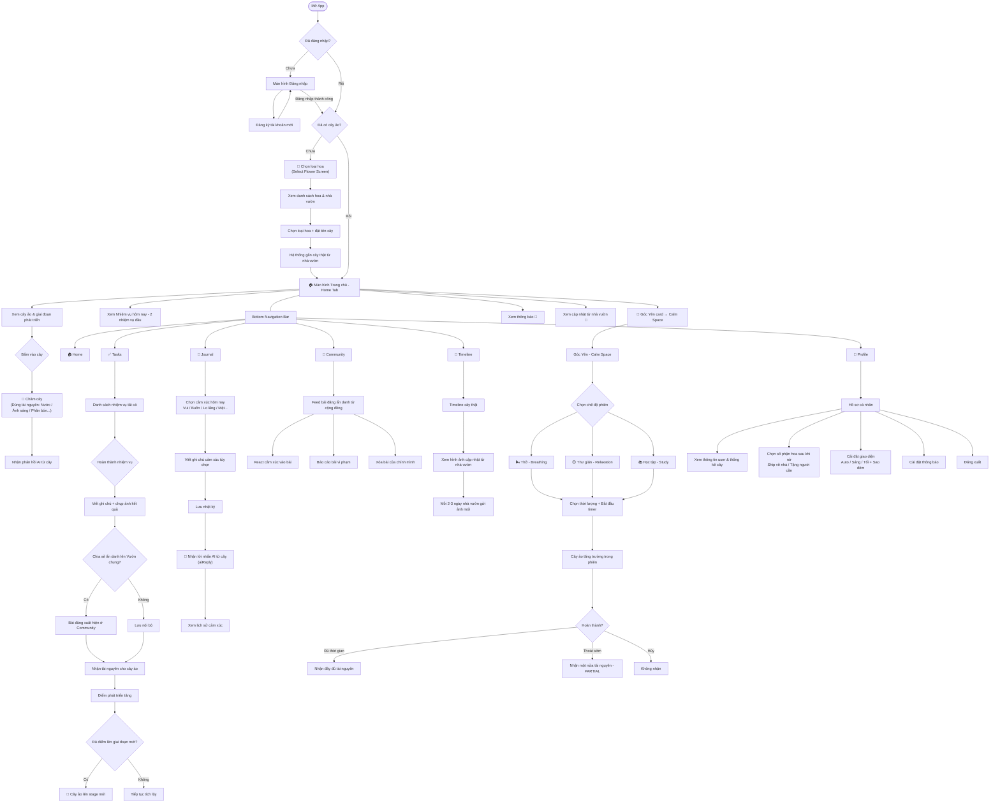

# 🌱 Mầm An — Tổng Quan Ứng Dụng

## Giới Thiệu

**Mầm An** (Garden Mobile) là ứng dụng di động hỗ trợ sức khỏe tinh thần theo phong cách "chăm cây ảo, chăm chính mình". Ứng dụng kết hợp giữa **gamification** và **self-care**, nơi người dùng được tặng một cây hoa ảo gắn liền với một cây hoa thật đang được chăm sóc tại nhà vườn đối tác. Mỗi hành động chăm sóc bản thân (hoàn thành nhiệm vụ, thở giãn, viết nhật ký cảm xúc...) đều được chuyển hóa thành "tài nguyên" giúp cây ảo phát triển qua các giai đoạn, từ hạt giống → mầm → chồi → nụ → hoa nở. Khi hoa nở, người dùng có thể nhận hoa về nhà hoặc tặng cho người cần.

Ứng dụng được xây dựng trên **Expo (React Native)** với giao diện thích ứng theo thời gian trong ngày (sáng/chiều/tối), sử dụng dynamic theming, hiệu ứng sao đêm, và mascot AI đồng hành.

---

## Flowchart Luồng Người Dùng

---

## Tóm Tắt 8 Tính Năng Chính

### 1. 🌸 Chọn Hoa & Khởi Tạo Hành Trình
- Người dùng chọn loại hoa yêu thích từ danh sách (Hướng dương, Lavender, Sen, Hồng, Cúc, Sen đá...).
- Xem thông tin: số cây còn sẵn, nhà vườn đối tác, thời gian nở hoa dự kiến.
- Đặt biệt danh cho cây (tuỳ chọn).
- Hệ thống tự động **gắn một cây thật từ nhà vườn đối tác** với cây ảo của người dùng.

---

### 2. 🌿 Cây Ảo & Hệ Thống Tài Nguyên
Đây là **cơ chế cốt lõi** của app — mọi hoạt động self-care đều quy đổi thành tài nguyên:

| Tài nguyên | Kiếm từ |
|---|---|
| 💧 Nước (WATER) | Hoàn thành nhiệm vụ liên quan nước |
| ☀️ Ánh sáng (SUNLIGHT) | Phiên thư giãn / ra ngoài trời |
| 🌿 Phân bón (FERTILIZER) | Nhiệm vụ ăn uống, chăm sóc cơ thể |
| 🌬️ Không khí (AIR) | Phiên thở giãn |
| 💚 Yêu thương (LOVE) | Chia sẻ cộng đồng, viết nhật ký |
| 🌫️ Sương (DEW) | Các phiên học tập, suy nghĩ |

Người dùng dùng tài nguyên để **chăm cây** — cây phản hồi bằng tin nhắn AI và hiệu ứng động. Cây lớn qua 5 giai đoạn: Hạt giống → Mầm → Chồi → Nụ → Nở hoa.

---

### 3. ✅ Nhiệm Vụ Hàng Ngày (Tasks)
- Danh sách nhiệm vụ self-care được gợi ý hàng ngày (uống nước, đi dạo, thở sâu, đọc sách...).
- Tiến trình hoàn thành hiển thị bằng thanh tiến độ.
- Khi hoàn thành: người dùng có thể **thêm ghi chú & ảnh chứng minh**.
- Tuỳ chọn **chia sẻ ẩn danh lên Vườn chung** để nhận bonus tài nguyên.
- Mỗi task hoàn thành trao tài nguyên + điểm phát triển cho cây ảo.

---

### 4. 📖 Nhật Ký Cảm Xúc (Journal)
- Ghi lại trạng thái cảm xúc hàng ngày bằng cách chọn mood icon (Vui, Buồn, Lo lắng, Mệt mỏi, Bình yên...).
- Viết ghi chú ngắn kèm theo (tối đa 300 ký tự).
- Khi chọn cảm xúc tiêu cực → app hiển thị thông điệp nhẹ nhàng + gợi ý tham khảo chuyên gia nếu cần.
- **AI tạo lời nhắn từ cây** (`aiReply`) để an ủi/động viên phù hợp với cảm xúc.
- Xem toàn bộ lịch sử nhật ký theo thời gian.

---

### 5. 🌻 Vườn Chung — Community (Ẩn Danh)
- Feed bài đăng được tạo tự động từ các nhiệm vụ hoàn thành có ảnh, **hoàn toàn ẩn danh**.
- Người dùng có thể react cảm xúc vào bài người khác.
- Báo cáo nội dung vi phạm.
- Xóa bài của chính mình.
- Tạo không gian kết nối nhẹ nhàng, không áp lực xã hội.

---

### 6. 🌿 Góc Yên — Calm Space (Focus Sessions)
3 chế độ phiên tập trung có tính giờ:
- **🌬️ Thở giãn** — hướng dẫn thở, nhận tài nguyên AIR
- **😌 Thư giãn** — nhạc nền, nhận SUNLIGHT/LOVE
- **📚 Học tập** — Pomodoro-style, nhận DEW

Trong phiên: cây ảo trực quan "lớn lên" theo tiến trình timer. Nhạc nền có thể bật/tắt. Hoàn thành đầy đủ nhận 100% reward, thoát sớm nhận 50%.

---

### 7. 📸 Timeline — Cây Thật Từ Nhà Vườn
- Nhà vườn đối tác định kỳ (2–3 ngày/lần) gửi ảnh cập nhật cây thật được gắn với tài khoản người dùng.
- Người dùng xem hành trình phát triển của cây thật qua timeline ảnh.
- Tạo cảm giác kết nối thực sự giữa nỗ lực self-care và thế giới thực.

---

### 8. 👤 Hồ Sơ & Cài Đặt (Profile)
- Thông tin tài khoản + thống kê: giai đoạn cây, điểm phát triển, số cây thật.
- **Chọn số phận hoa sau khi nở**: ship về nhà 📦 hoặc tặng người cần 💚.
- **Dynamic Theming**: giao diện tự đổi theo giờ (sáng/chiều/tối) hoặc chọn thủ công.
- Hiệu ứng sao đêm tuỳ chỉnh.
- Quản lý thông báo đẩy.
- Đăng xuất với mascot AI tương tác.

---

> [!NOTE]
> **Mầm An không thay thế tư vấn sức khỏe tâm thần chuyên nghiệp.** App được thiết kế như một người bạn đồng hành nhẹ nhàng, khuyến khích các thói quen tích cực hàng ngày.
